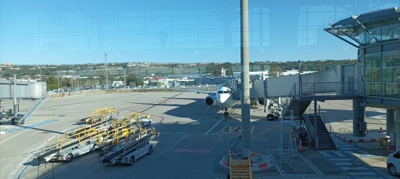

# CTF OSINT - Le voyage de Noobosaurus R3x

## Présentation du CTF 
**ID** 51 dans **les CTFs de Cyrhades**

Noobosaurus R3x nous offre ce petit challenge d'OSINT, merci à lui.
N'hésitez pas à le rejoindre sur sa chaine Youtube : [https://www.youtube.com/@NoobosaurusR3x](https://www.youtube.com/@NoobosaurusR3x)

# Format du Flag

Noobo{<CODE_AVION>_<TERMINAL>_<CODE OACI départ>_<Heure porte départ>_<CODE OACI arrivée>_<Heure porte arrivée>}

Exemple :
Noobo{E170_T2A_LYN_21:28_LRT_23:01}
Noobo{B738_T1C_CDG_07:40_MRS_09:05}
Noobo{A319_T3B_LYS_17:00_ORY_21:40}

## Aperçu

-----------

## Installation manuel
Vous n'utilisez pas l'application **les CTFs de Cyrhades** ? C'est dommage !
Mais voici comment installer ce CTF manuellement :

> git clone https://github.com/Hack-Oeil/OSINT_VOYAGE_NOOBOSAURUS_R3X.git

> cd OSINT_VOYAGE_NOOBOSAURUS_R3X

